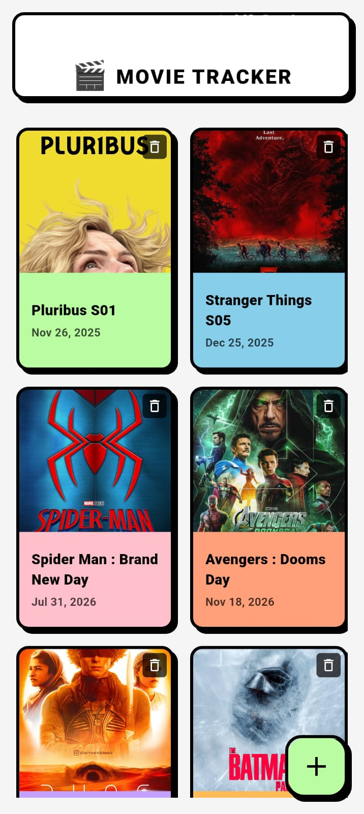

# 🎬 Movie Tracker

A modern, neobrutalist-styled Flutter application for tracking movie releases with a customizable Android home screen widget. Never miss a movie release date again!


## ✨ Features

### 📱 Core Functionality
- **Movie Management**: Add, view, and delete your anticipated movies
- **Custom Posters**: Upload movie posters from your gallery
- **Release Date Tracking**: Set and track precise release dates

### 🏠 Android Home Screen Widget
- **Live Widget**: Display your tracked movies directly on your home screen
- **Customizable Colors**: Choose from 8 vibrant colors for each movie card in the widget
- **Quick Actions**: 
  - Refresh button to update widget data
  - Add new movie button for quick access
- **Auto-sync**: Widget automatically updates when movies are added, edited, or deleted
- **Beautiful Design**: Neobrutalist aesthetic with bold borders and vibrant colors

## 📸 Screenshots

<div align="center">
  <table>
    <tr>
      <td></td>
      <td></td>
      <td></td>
    </tr>
  </table>
</div>

## 🚀 Getting Started

### Prerequisites

- Flutter SDK (>=3.8.1)
- Android Studio or VS Code with Flutter extensions
- An Android device or emulator for testing the widget

### Installation

1. **Clone the repository**
   ```bash
   git clone https://github.com/yourusername/movie_tracker.git
   cd movie_tracker
   ```

2. **Install dependencies**
   ```bash
   flutter pub get
   ```

3. **Run the app**
   ```bash
   flutter run
   ```

### Widget Setup

After installing the app:
1. Long-press on your Android home screen
2. Tap "Widgets"
3. Find "Movie Tracker" widget
4. Drag it to your home screen
5. Your tracked movies will appear automatically!


## 🎯 Usage

### Adding a Movie

1. Tap the "+" button on the home screen
2. Upload a movie poster (optional)
3. Enter the movie name
4. Select the release date
5. Choose a widget card color
6. Tap "SAVE MOVIE"

### Deleting a Movie

Tap the delete icon on any movie card in the home screen.

### Widget Customization

The widget automatically displays:
- Movie poster (if provided)
- Movie name
- releasing date
- Custom background color (chosen during movie creation)
